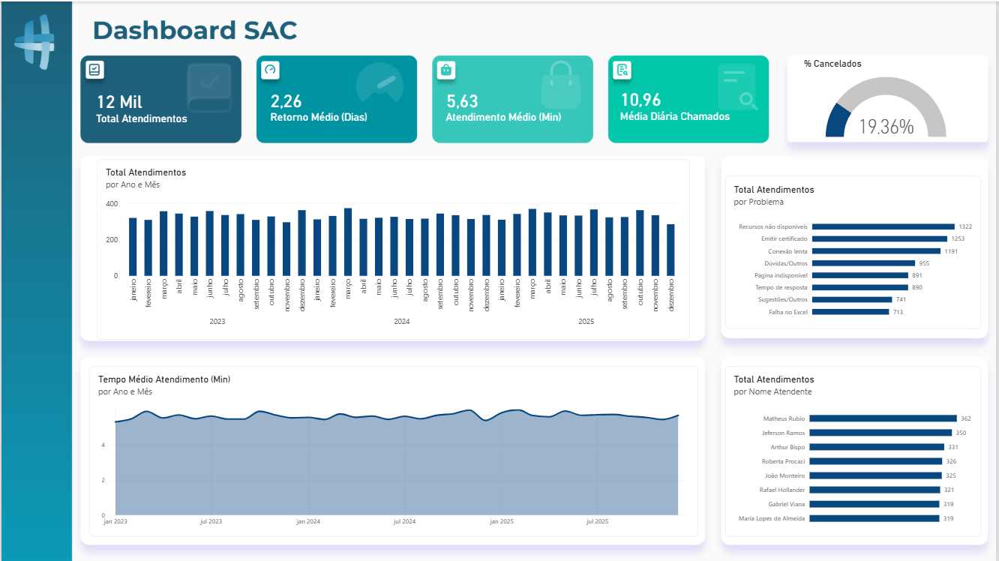

# 📊 Dashboard SAC | Análise de Atendimento

## 🎯 Objetivo

Analisar o desempenho do SAC e identificar padrões relacionados ao volume de chamados, ao tempo de atendimento e aos problemas reportados.

## 🗂️ Sobre o projeto

Este projeto apresenta um dashboard desenvolvido no Power BI para análise de dados de atendimento ao cliente, utilizando uma base de dados em Excel.

A análise contempla o período de **2023 a 2025** e foi estruturada para acompanhar indicadores de volume, tempo de resposta, tempo de atendimento, cancelamentos e distribuição dos chamados.

O projeto foi desenvolvido como prática de análise e visualização de dados, aplicando recursos do Power BI para transformar dados de atendimento em indicadores e visualizações que facilitam a interpretação dos resultados.

## 🛠️ Ferramentas utilizadas

- **Power BI**: modelagem, criação de medidas, KPIs e visualizações
- **Excel**: fonte de dados utilizada no projeto

## 📈 Principais indicadores

O dashboard apresenta os seguintes indicadores:

| Indicador | Resultado |
|---|---:|
| Total de atendimentos | ~12 mil |
| Tempo médio de resposta | 2,26 dias |
| Tempo médio de atendimento | 5,63 min |
| Média diária de chamados | 10,96 |
| Chamados cancelados | 19,36% |

## 🔎 Análises realizadas

### Evolução dos atendimentos

Análise do volume de atendimentos ao longo do período de 2023 a 2025, permitindo acompanhar a variação mensal dos chamados.

### Tempo médio de atendimento

Acompanhamento da evolução mensal do tempo médio de atendimento, possibilitando observar o comportamento desse indicador ao longo do período analisado.

### Atendimentos por problema

Distribuição dos chamados de acordo com os problemas reportados.

Entre as categorias com maior volume de atendimentos estão:

- Recursos não disponíveis
- Emitir certificado
- Conexão lenta
- Dúvidas/Outros
- Página indisponível

### Atendimentos por atendente

Análise da distribuição dos atendimentos entre os profissionais responsáveis pelo SAC, permitindo comparar o volume de chamados atendidos por cada colaborador.

## 🖼️ Dashboard



## 📁 Estrutura do projeto

```text
dashboard-sac-power-bi/
│
├── data/
│   └── Base SAC.xlsx
│
├── images/
│   ├── Plano de Fundo.png
│   └── dashboard-sac.png
│
├── relatorio sac.pbix
│
└── README.md

